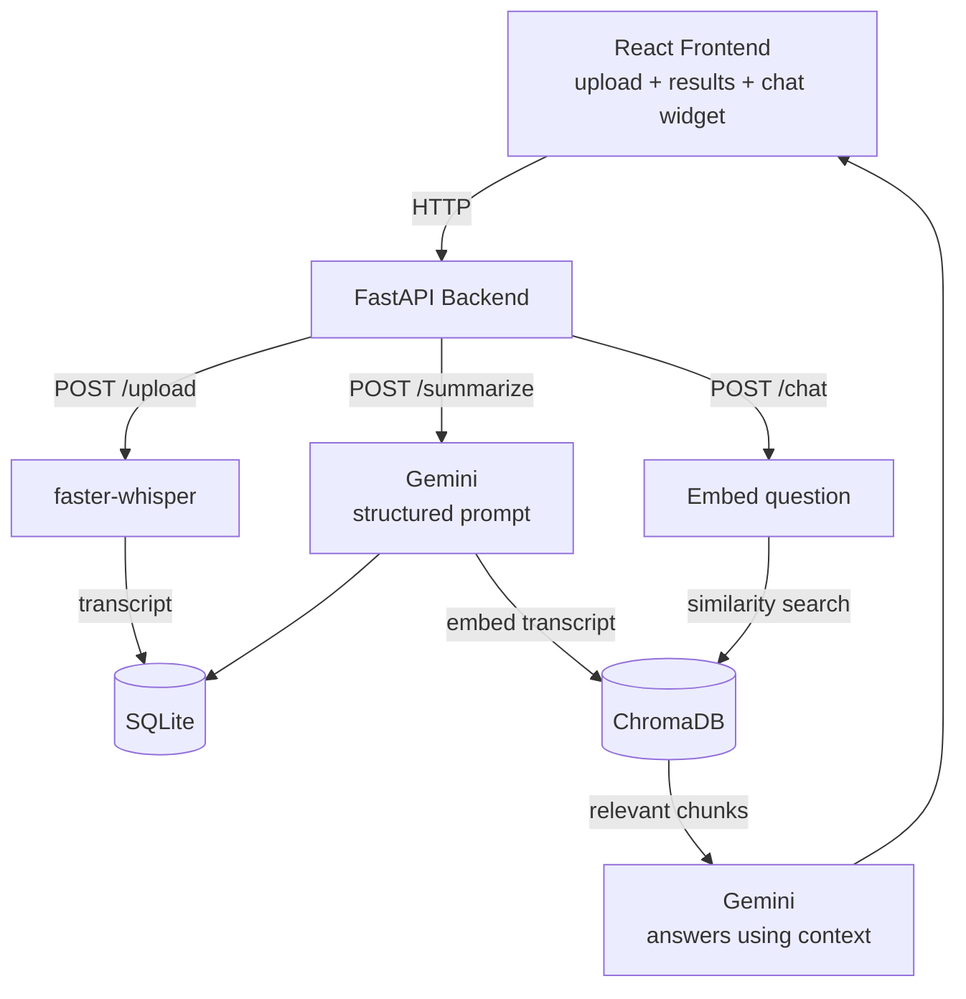

# Recap - AI Meeting Summarizer with RAG Chat

A tool that takes a meeting recording and turns it into something actually useful - a transcript, a summary, decisions, action items, and now a chatbot you can ask questions to across all your past meetings.

I built this originally as a placement assignment, then kept extending it because the core idea (turning messy audio into structured, searchable knowledge) had a lot more room to grow.

## What it actually does

You upload an audio file. In the background:

1. The audio gets transcribed to text
2. That transcript gets sent to an LLM which pulls out a summary, key decisions, and action items (with owner names when they're mentioned)
3. The transcript also gets embedded and stored in a vector database
4. You can then open the chat widget and ask things like "what did we decide about the launch" or "who's handling the backend testing" and it'll search across every meeting you've processed and answer using the actual transcript content, not a guess

That last part is the interesting bit technically - it's a proper RAG (Retrieval-Augmented Generation) setup, not just a chatbot wrapper around an LLM.

## Tech stack and why

- **FastAPI** for the backend - it's fast to build with, gives you automatic API docs at `/docs` for free which made testing everything a lot easier while developing
- **faster-whisper** for transcription - runs locally on CPU, no API key or per-minute cost, and accuracy is genuinely good for the `base` model
- **Google Gemini (gemini-3.6-flash)** for the LLM work - free tier was generous enough for a project like this, and it's solid at following structured output instructions
- **SQLite** for storing meetings, transcripts, and summaries - didn't need anything heavier for this scale
- **ChromaDB** as the vector database for the RAG chatbot - runs locally, persists to disk, no external service needed
- **sentence-transformers (all-MiniLM-L6-v2)** for generating embeddings - small, fast, free, runs on CPU
- **React + Vite** for the frontend, custom-styled (no component library) because I wanted this to look like an actual product, not a bootstrap template

## Architecture



### The summarization flow

When `/summarize` is called with a meeting id, it pulls the transcript from SQLite and sends it to Gemini with a prompt that forces a specific JSON shape back:

```json
{
  "summary": "...",
  "key_decisions": ["...", "..."],
  "action_items": ["...", "..."]
}
```

I spent a decent amount of time on this prompt specifically because LLMs don't always return clean JSON on their own - sometimes they wrap it in markdown code fences, sometimes they add a sentence before or after. There's a small cleanup step in the code that strips markdown fences if Gemini adds them, and the whole thing is wrapped in a try/except so a bad response doesn't crash the app, it just returns an error message instead.

### The RAG chat flow

This is the part I'm most proud of, honestly. Here's what happens step by step when someone asks a question:

1. The moment a meeting gets summarized, its transcript is also converted into an embedding (a vector of numbers that represents the meaning of the text, not just the words) using `all-MiniLM-L6-v2`, and that embedding gets stored in ChromaDB along with the meeting's filename and id
2. When a question comes in through `/chat`, it gets embedded the exact same way
3. ChromaDB compares the question's embedding against every stored meeting embedding and returns the most similar ones (top 3, currently)
4. Those retrieved transcript chunks get stuffed into a prompt along with the original question, and Gemini is told explicitly to only answer using that context - not from its own general knowledge
5. The answer comes back along with which meeting(s) it pulled the info from, so there's some transparency about where the answer is coming from instead of it just being a black box

This means if you have 20 meetings stored and ask a question, it doesn't send all 20 transcripts to the LLM (which would be slow and expensive) - it only sends the ones that are actually relevant to your question. That's the whole point of the "retrieval" step in RAG.

## Project structure

```
meeting-summarizer/
├── backend/
│   ├── main.py              # everything - endpoints, DB, RAG logic
│   ├── requirements.txt
│   ├── uploads/              # gitignored - raw audio files land here temporarily
│   └── chroma_db/            # gitignored - vector DB storage, created automatically
├── frontend/
│   ├── src/
│   │   ├── App.jsx           # upload UI, results, and the chat widget
│   │   └── App.css
│   └── package.json
└── README.md
```

## Running it locally

You'll need Python 3.12, Node.js, and a free Gemini API key from [aistudio.google.com/apikey](https://aistudio.google.com/apikey).

**Backend:**
```bash
cd backend
python -m venv venv
venv\Scripts\activate        # on Windows
pip install -r requirements.txt
```

Create a `.env` file in `backend/` with:
```
GEMINI_API_KEY=your_key_here
```

Then run it:
```bash
uvicorn main:app --reload
```

First run will take a bit longer since it downloads the Whisper model and the embedding model - both are one-time downloads, everything runs offline after that.

**Frontend:**
```bash
cd frontend
npm install
npm run dev
```

Open `http://localhost:5173`, drag in an audio file, hit "Process meeting," and once it's done, click the round chat icon in the bottom right to ask questions about it.

## Some things I learned building this

- Forcing structured JSON output from an LLM sounds simple but you have to actually plan for it failing sometimes - models occasionally add extra text or formatting even when told not to
- Vector search only helps if what you're storing and what you're searching for are embedded the same way - I initially almost made the mistake of using different chunking for storage vs. query time
- A generic-looking frontend makes a project feel like a tutorial clone. Spending time on actual visual identity (the color palette, the waveform motif tied to the audio subject, custom fonts) made a real difference in how "finished" this feels
- Testing a fresh clone of your own repo before submitting catches problems no amount of testing on your own machine will - I caught a couple of setup issues this way that would've looked bad in front of an evaluator

## What's next (if I keep going)

- Speaker diarization, so the transcript shows who said what instead of one continuous block
- Exporting action items directly to Google Calendar or Notion instead of just displaying them
- A simple analytics view - most frequently assigned people, meeting frequency over time, that kind of thing

## Demo

[link to demo video]